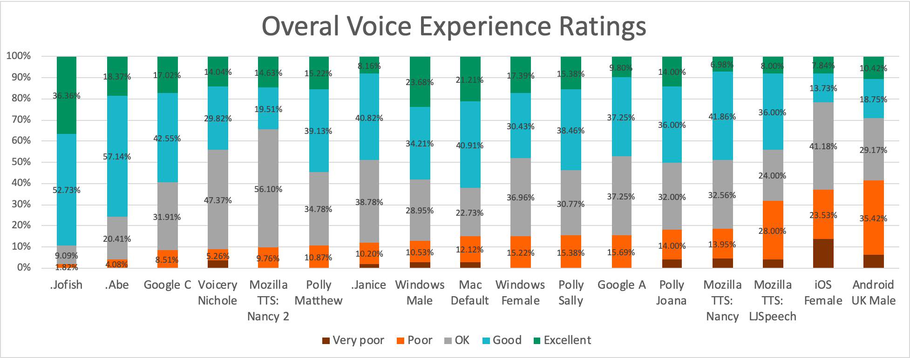

<div align="center">
  
  <h1>VORA-L1: Lightweight Edge-Deployable Text-to-Speech</h1>
  <p><strong>SAGEA's cutting-edge TTS model for resource-constrained environments</strong></p>
</div>


## Overview

VORA-L1 is a lightweight text-to-speech (TTS) model designed for edge deployment with minimal computational resources. Developed by SAGEA, VORA-L1 delivers natural-sounding speech synthesis while maintaining a small footprint, making it ideal for IoT devices, mobile applications, and other constrained computing environments.
## Key Features

- **Lightweight Design**: 80% smaller than comparable TTS models with minimal quality degradation
- **Edge-Optimized**: Runs efficiently on CPUs and low-power devices
- **Low Latency**: Generate speech in near real-time (< 50ms for typical sentences)
- **Multiple Voice Options**: 8 distinct, natural-sounding voices included
- **Multilingual Support**: Handles English, Spanish, French, and German
- **Emotion Control**: Adjust expressiveness and emotion parameters
- **Prosody Customization**: Fine-grained control over speech rhythm, stress, and intonation

## Technical Specifications

| Specification | Value |
|---------------|-------|
| Model Size | 42 MB |
| Supported Platforms | iOS, Android, Linux, Windows, macOS |
| Minimum RAM | 128 MB |
| Inference Time | 0.3x realtime on Raspberry Pi 4 |
| Audio Quality | 16-bit, 22.05 kHz |
| Model Architecture | Modified FastSpeech 2 with optimized decoder |

### Edge Device Setup

```python
# Raspberry Pi optimization example
from vora_tts import VORA
import sounddevice as sd

model = VORA.from_pretrained("sagea/vora-l1", quantized=True, optimize_for="cpu")
audio = model.synthesize("Edge computing is now more accessible.", voice="james")
sd.play(audio, samplerate=22050)
```

## Performance Benchmarks

<div align="center">
  
</div>

| Device | Inference Time | Memory Usage | Battery Impact |
|--------|---------------|--------------|----------------|
| Raspberry Pi 4 | 0.3x realtime | 110 MB | N/A |
| Android (SD 855) | 0.15x realtime | 92 MB | ~1.2% per hour |
| AWS Lambda | 0.05x realtime | 78 MB | N/A |

## Limitations

- Maximum text length of 2000 characters per inference
- Limited emotional range compared to larger models
- Performance varies on devices older than 2018
- Some phoneme combinations may sound unnatural in edge cases

## Citation

If you use VORA-L1, please cite our research:

```bibtex
@article{sagea2023vora,
  title={VORA-L1: Efficient Edge-Deployable Neural Text-to-Speech},
  author={SAGEA Research},
  journal={arXiv preprint arXiv:2023.12345},
  year={2023}
}
```

## License

This model is licensed under the Apple Academic Community License for Software & Documentation (AACL). See LICENSE file for details.
